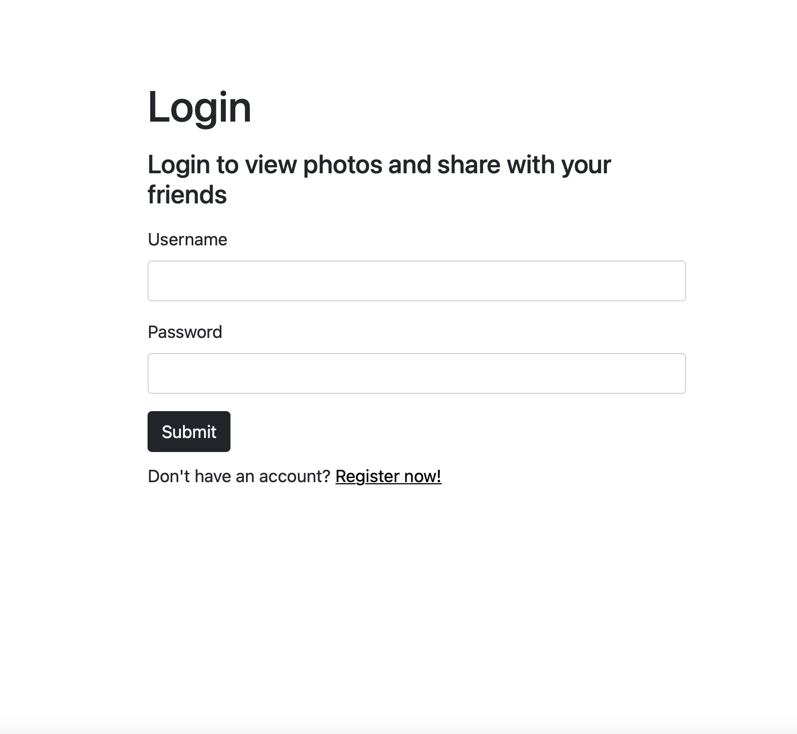
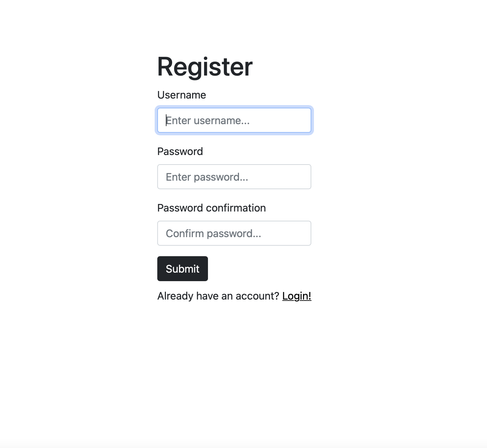
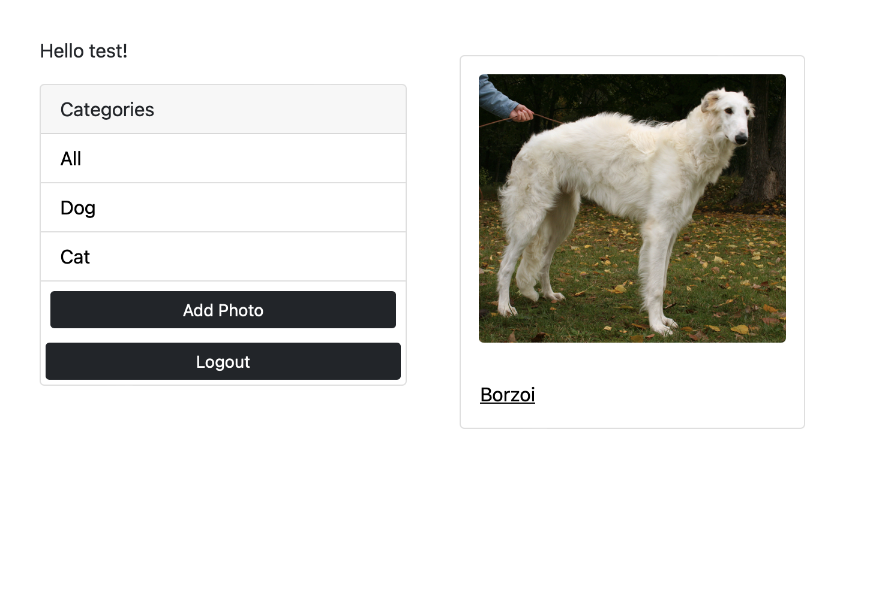
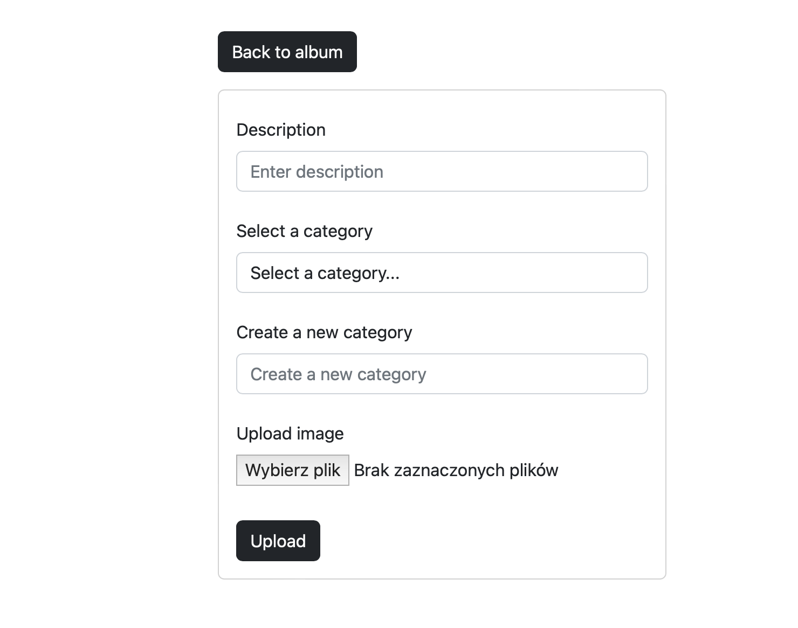

# Photo Album

An application for sharing photos with friends in the form 
of popular Polaroids. The project was made in the Django framework.

# Login/ Register new account
The application gives us the option of logging in or registering 
a new account.

 

# Home page
You have the option of sending photos that will appear on the main page and after clicking on the description, the full image will be displayed to us. You can see in the menu all categories that have already been created. You can also filter photos by category.



# Adding photo form
When filling in the form, we give the photo a category and description. When there is no category that would best describe our photo, we can create a new one or leave the photo without categories.



# Saving photos to the database
It has not been entered into the repository for practical and security reasons !!!
The photos are created in the formula and added to the S3 bucket by AWS. The whole project is connected with the appropriate bucket and we can take photos from it and save it in it.

If you have your own access keys to the AWS S3 bucket:

* Install these packages first!
```python
pip install boto3
django-storages
pip install python-dotenv
```

* Connecting to the database in the settings.py file
Imports:
```python
from pathlib import Path
from dotenv import load_dotenv
import os
```

* Installed apps:
```python
INSTALLED_APPS = [
    'django.contrib.admin',
    'django.contrib.auth',
    'django.contrib.contenttypes',
    'django.contrib.sessions',
    'django.contrib.messages',
    'django.contrib.staticfiles',
    'storages',
    'album.apps.AlbumConfig',   
]
```
* Add this at the bottom
```python
load_dotenv()
DEFAULT_FILE_STORAGE = 'storages.backends.s3boto3.S3Boto3Storage'
AWS_ACCESS_KEY_ID = os.getenv('AWS_ACCESS_KEY_ID')
AWS_SECRET_ACCESS_KEY = os.getenv('AWS_SECRET_ACCESS_KEY')
AWS_STORAGE_BUCKET_NAME = os.getenv('AWS_STORAGE_BUCKET_NAME')
AWS_QUERYSTRING_AUTH = False
```

Here ```os.getenv('AWS_ACCESS_KEY_ID')``` yoy can pass your keys or if you want keep them hidden you have to create .env folder and put sensitive data in it.

* .env.example
```python
AWS_ACCESS_KEY_ID=
AWS_SECRET_ACCESS_KEY=
AWS_STORAGE_BUCKET_NAME=
```

DON'T FORGET TO PUT YOUR .EVV TO .GITIGNORE FILE!
